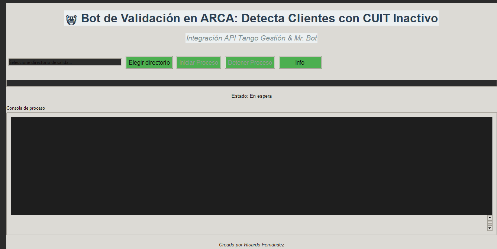
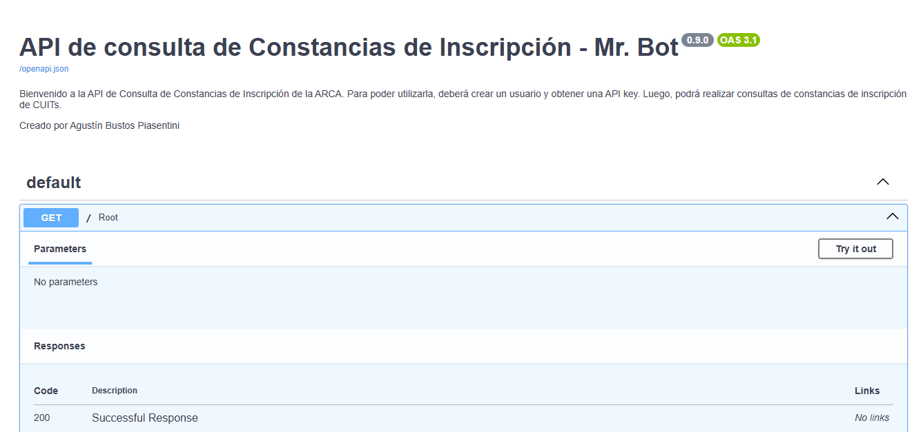

# 🤖 Bot de Validación en ARCA

Este script automatiza la validación de CUITs de clientes utilizando las APIs de Tango Gestión y Arca con la api de  Mr. Bot.

## Descripción

El script se conecta a la API de Tango Gestión para obtener la lista de clientes, filtra los clientes que cumplen con ciertas condiciones y valida el CUIT de cada cliente con la API de Arca. Finalmente, genera un reporte en Excel con los clientes que presenten problemas en la validación.

### Funcionamiento Detallado

1. **Conexión a la API de Tango Gestión:** El script utiliza las credenciales proporcionadas en el archivo `Access_Key.txt` para autenticarse y obtener la lista de clientes.
2. **Filtrado de Clientes:** Se filtran los clientes según los siguientes criterios:
    - El cliente debe tener un CUIT asignado.
    - El campo `COD_GVA14` debe terminar con la letra "F".
    - El cliente debe estar habilitado.
3. **Validación de CUITs:** Se itera sobre la lista de clientes filtrados y se valida cada CUIT con la API de Arca (Mr Robot).
4. **Generación de Reporte:** Se genera un archivo Excel (`reporte_afip_errores_[timestamp].xlsx`) con los clientes que presentaron problemas en la validación. El reporte incluye el código `COD_GVA14`, la razón social, el CUIT y los detalles del error.

## Requisitos Previos

- 🐍 Python 3.x
- 📦 Librerías de Python listadas en `requirements.txt`
- 🔑 Credenciales de acceso a las APIs de Tango Gestión y Arca (Mr Robot)
- 🏢 Tener instalado Tango Gestión

## Instalación

1. 📥 Clona este repositorio:
```bash
git clone https://github.com/tuusuario/Bot_Contancia_baja.git
```
2. 📂 Navega al directorio del proyecto:
```bash
cd Bot_Contancia_baja
```
3. 💻 Instala las dependencias:
```bash
pip install -r requirements.txt
```

## Configuración

1. 🔑 Crea un archivo llamado `Access_Key.txt` en el directorio del proyecto.
2. ✍️ Agrega las credenciales de acceso a las APIs de Tango Gestión y Arca en el archivo `Access_Key.txt` con el siguiente formato:

```
TANGO_API_TOKEN=tu_token_de_tango
TANGO_COMPANY_ID=tu_id_de_empresa_de_tango
AFIP_USER=tu_usuario de Mr. Bot
AFIP_API_KEY=tu_api_key_de_ Mr. Bot 
```

## Uso

1. ▶️ Ejecuta el script `Bot_de_Validación_en_ARCA.py`.
2. 📁 Selecciona el directorio de salida donde se guardará el reporte de Excel.
3. 🚀 Haz clic en el botón "Iniciar Proceso".
4. ✅ El script validará los CUITs y generará un reporte en Excel en el directorio de salida especificado.

## Preguntas Frecuentes (FAQ)

### ¿Qué hago si el script no se conecta a la API de Tango Gestión?

Asegúrate de que las credenciales en el archivo `Access_Key.txt` sean correctas y que el servidor de Tango Gestión esté en línea.

### ¿Qué hago si el script no se conecta a la API de Arca?

Asegúrate de que las credenciales en el archivo `Access_Key.txt` sean correctas y que la API de Arca esté disponible.

### ¿Cómo puedo modificar los criterios de filtrado de clientes?

Puedes modificar la función `filtrar_clientes` en el script `Bot_de_Validación_en_ARCA.py` para ajustar los criterios de filtrado.

## Solución de Problemas

### Error: "No se pudo encontrar el archivo Access_Key.txt"

Asegúrate de haber creado el archivo `Access_Key.txt` en el directorio del proyecto y de haber agregado las credenciales de acceso a las APIs.

### Error: "Error de autenticación con la API de Tango Gestión"

Verifica que las credenciales en el archivo `Access_Key.txt` sean correctas.

### Error: "Error de conexión con la API de Arca"

Verifica que las credenciales en el archivo `Access_Key.txt` sean correctas y que la API de Arca esté disponible.

## Contribución

Las contribuciones son bienvenidas. Si deseas contribuir a este proyecto, por favor sigue los siguientes pasos:

1. 🍴 Haz un fork de este repositorio.
2. 🌿 Crea una nueva rama con tu contribución.
3. 💾 Realiza los cambios y haz commit de los mismos.
4. 📤 Haz un pull request a la rama principal de este repositorio.

## Autor

👨‍💻 Ricardo Fernández

## Contacto

Para cualquier consulta o problema, por favor contacta a través de un issue en el repositorio de GitHub o directamente por correo electrónico a la dirección provista en el perfil de GitHub.

# Añadir enlaces clickeables

- [API de Mr. Bot](https://api-constancias-de-inscripcion.mrbot.com.ar/docs#/default/root__get)
- [API de Tango Gestión](https://ayudas.axoft.com/23ar/documentos/operacion/apertura_oper/api_oper/)

Agradecer a [abustosp](https://github.com/abustosp) por la API de Mr. Bot.




